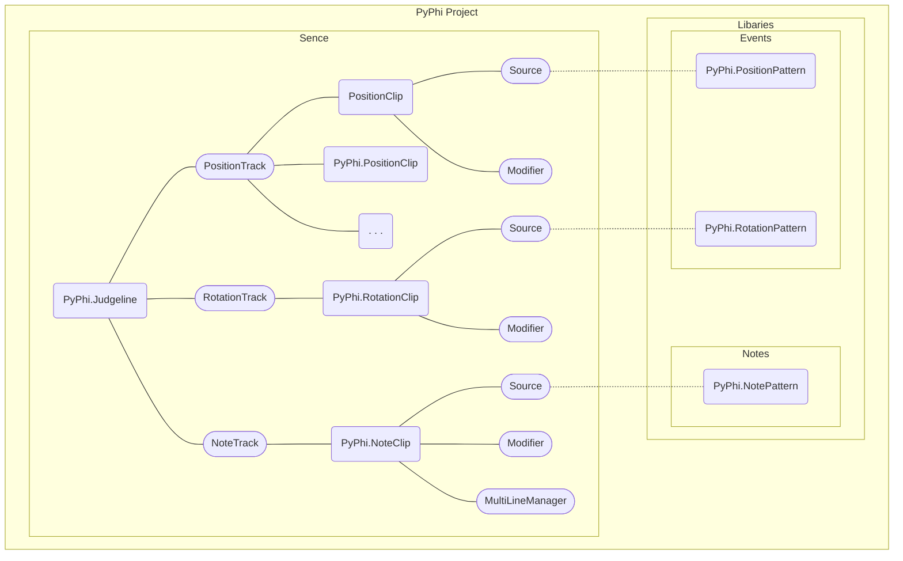

# PyPhiEditor

Phigros 谱面编辑器。制谱就像剪视频一样简单。

Phigros chart editor made with Python and Pygame. Charting just like video editing.

## 特性 - Features

* 更符合操作逻辑的用户界面，所有人都可以快速上手
* 更简单的多线事件和音符处理
* 现代的 GUI 界面，更好的屏幕适配

---

* Simpler GUI, which almost everyone can master it at once.
* Easier muti-judge-line events and notes editor.
* Modern GUI design & better screen adaptation.

## 项目结构 - Project Structure

